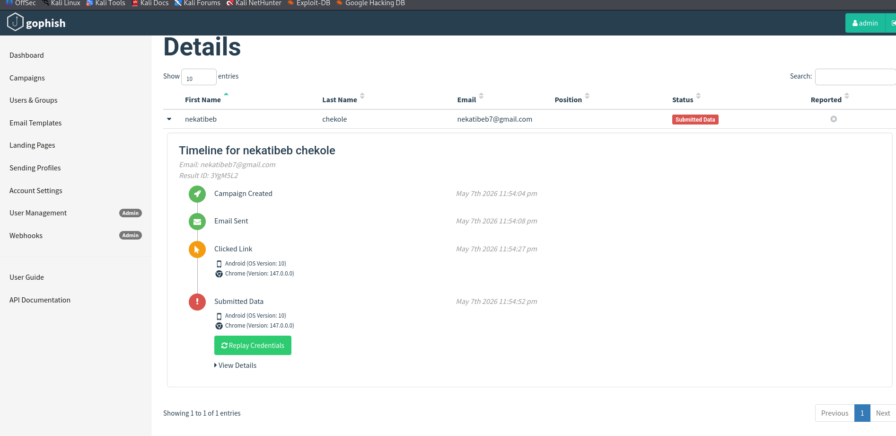

# Cyber-Security-Awareness-Phishing-Simulation-
A security awareness project using Gophish framework to simulate phishing attacks and analyze user vulnerability
# Phishing Simulation & Security Awareness Project
This project demonstrates a simulated phishing campaign designed to test and improve organizational security awareness. Using the **Gophish** framework, it simulates real-world attack vectors to identify human-risk vulnerabilities.

## 🛠️ Tools Used
*   **Gophish:** Open-source phishing framework.
*   **HTML/CSS:** For creating realistic email templates.
*   **Kali Linux:** Environment for simulation setup.

## 🚀 Key Features
*   **Custom Templates:** Crafted realistic corporate emails to test user alertness.
*   **Real-time Analytics:** Tracked email opens, link clicks, and credential submissions.
*   **Target Groups:** Managed simulated targets and sending profiles effectively.

## 📊 Project Workflow
1.  **Preparation:** Designed an enticing email template.
2.  **Execution:** Launched a campaign targeting a specific test group.
3.  **Analysis:** Monitored the dashboard to see user interaction levels.
# Cyber-Security-Awareness-Phishing-Simulation

A comprehensive security awareness project using the **Gophish** framework to simulate real-world phishing attacks and analyze human-risk vulnerabilities.

---

## 🛠 Tools Used
* **Gophish:** Open-source phishing framework for campaign management.
* **HTML/CSS:** Used to craft deceptive email templates and landing pages.
* **Kali Linux:** The primary environment for simulation setup and hosting.
* **SMTP Interface:** Configured for high-deliverability email routing.

## 🚀 Key Features
* **Custom Templates:** Designed realistic "Google Security" alerts to test user alertness.
* **Real-time Analytics:** Tracked the full lifecycle: Email Sent → Opened → Clicked → Data Submitted.
* **Target Management:** Organized specific user groups and sending profiles for granular testing.

---

## 📊 Case Study: Campaign "war"
This section details a successful simulation performed on May 7th, 2026.

### 1. Campaign Workflow

1.  **Preparation:** Designed a "Google 2-Step Verification" email template and a matching credential harvest page.
2.  **Execution:** Launched the campaign targeting the "nekatibeb" group.
3.  **Analysis:** Monitored the dashboard to track the speed and success rate of the compromise.

### 2. Results Dashboard
| Metric | Count | Rate |
| :--- | :--- | :--- |
| **Total Emails Sent** | 1 | 100% |
| **Emails Opened** | 1 | 100% |
| **Links Clicked** | 1 | 100% |
| **Data Submitted** | 1 | 100% |
| **Email Reported** | 0 | 0% |

### 3. Timeline of Compromise
* **11:54:08 PM:** Email Sent.
* **11:54:27 PM:** User clicked the link (**19s after delivery**).
* **11:54:52 PM:** User submitted credentials (**44s after delivery**).

---

## 🛡️ Findings & Recommendations
* **Observation:** The user was compromised in under one minute, demonstrating the effectiveness of "Authority" and "Urgency" in social engineering.
* **Vulnerability:** The simulation was successful on a mobile device (Android 10), where URL inspection is less intuitive for users.
* **Action Plan:** Recommended organization-wide training on verifying sender identity and implementing hardware-based MFA.

---

> **Disclaimer:** This project is for educational and authorized security testing purposes only. Unauthorized use of these techniques is illegal.
