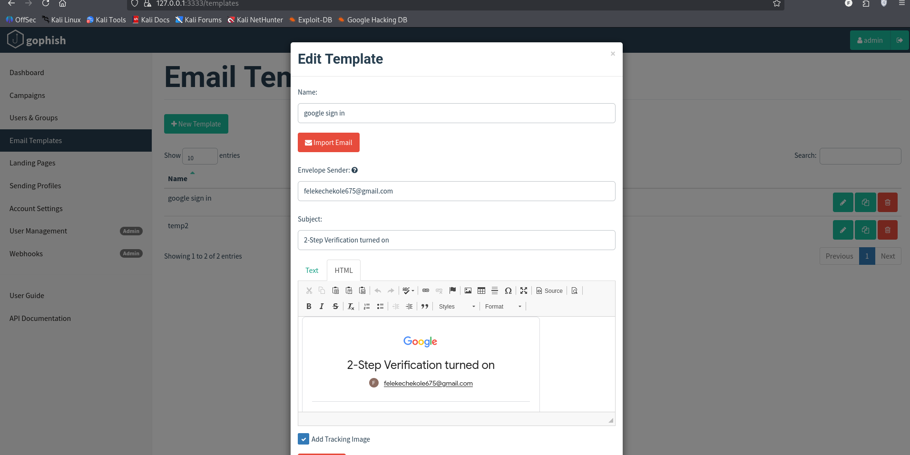
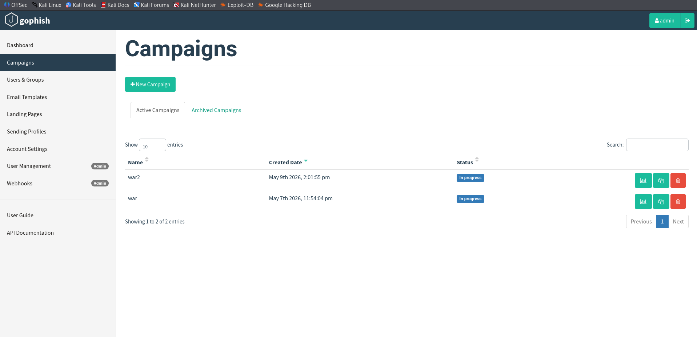
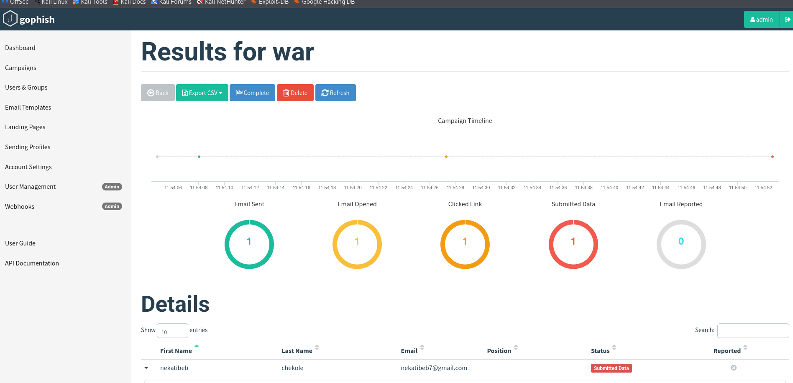
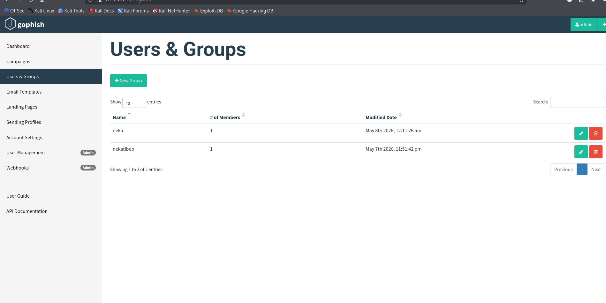
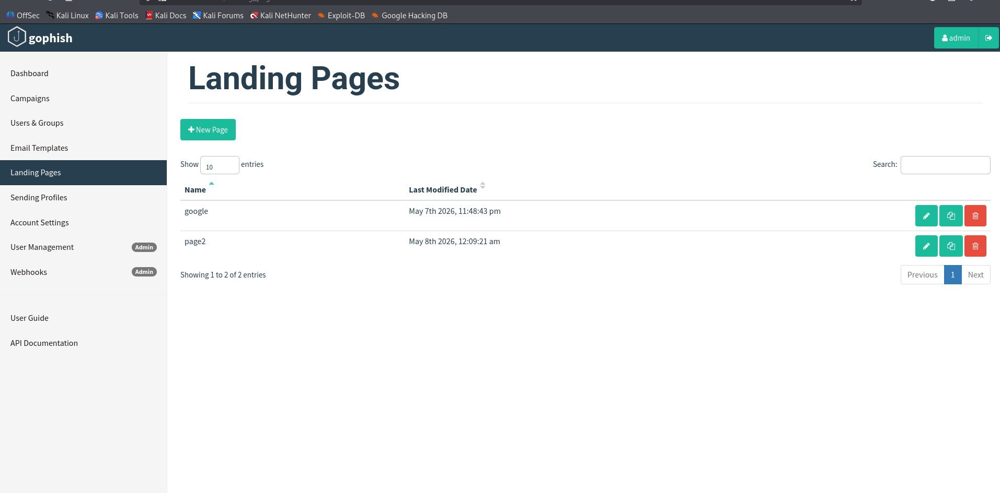
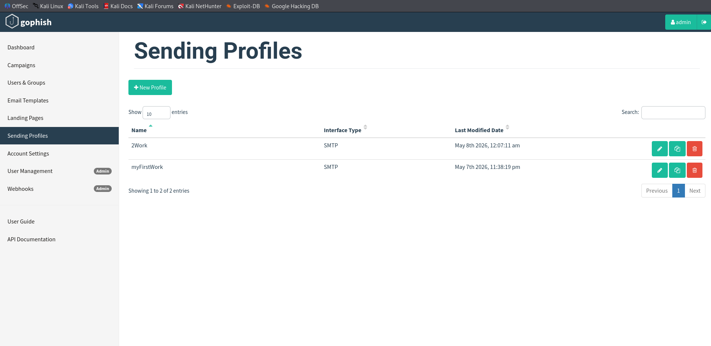

# Cyber-Security-Awareness-Phishing-Simulation-
A security awareness project using Gophish framework to simulate phishing attacks and analyze user vulnerability
# Phishing Simulation & Security Awareness Project
This project demonstrates a simulated phishing campaign designed to test and improve organizational security awareness. Using the **Gophish** framework, it simulates real-world attack vectors to identify human-risk vulnerabilities.

## 🛠️ Tools Used
*   **Gophish:** Open-source phishing framework.
*   **HTML/CSS:** For creating realistic email templates.
*   **Kali Linux:** Environment for simulation setup.

## 🚀 Key Features
*   **Custom Templates:** Crafted realistic corporate emails to test user alertness.
*   **Real-time Analytics:** Tracked email opens, link clicks, and credential submissions.
*   **Target Groups:** Managed simulated targets and sending profiles effectively.

## 📊 Project Workflow
1.  **Preparation:** Designed an enticing email template.
2.  **Execution:** Launched a campaign targeting a specific test group.
3.  **Analysis:** Monitored the dashboard to see user interaction levels.

## 1. Email Templates

This is the core content of the phishing attempt. The screenshot shows an "Edit Template" window for a template named **"google sign-in."**

* **Subject Line:** "2-Step Verification selection."
* **Sender Address:** Spoofed or designated as `felekechekole675@gmail.com`.
* **Content:** The email body mimics an official Google security notification with the heading **"2-Step Verification turned on."** It includes a professional-looking layout with the Google logo to instill a sense of urgency and legitimacy in the recipient.
* **Technical Detail:** A tracking image is likely enabled to monitor if the recipient opens the email.
 
## 📊 Case Study: Campaign "war"
This section details a successful simulation performed on May 7th, 2026.

### 2. Campaign Workflow

1.  **Preparation:** Designed a "Google 2-Step Verification" email template and a matching credential harvest page.
2.  **Execution:** Launched the campaign targeting the "nekatibeb" group.
3.  **Analysis:** Monitored the dashboard to track the speed and success rate of the compromise.

### 3. Results Dashboard

| Metric | Count | Rate |
| :--- | :--- | :--- |
| **Total Emails Sent** | 1 | 100% |
| **Emails Opened** | 1 | 100% |
| **Links Clicked** | 1 | 100% |
| **Data Submitted** | 1 | 100% |
| **Email Reported** | 0 | 0% |

### 4. Timeline of Compromise

* **11:54:08 PM:** Email Sent.
* **11:54:27 PM:** User clicked the link (**19s after delivery**).
* **11:54:52 PM:** User submitted credentials (**44s after delivery**).
* ## 5. Users & Groups
  

  
This section defines the targets of the simulation.

* **Groups Configured:** Two groups are visible: 
    * **"extra"**: Contains 1 member.
    * **"individual"**: Contains 1 member.
* **Purpose:** These groups serve as the mailing list for the campaign. In a professional setting, these would represent different departments or risk-profiles within an organization.

---

## 6. Landing Pages

This section defines what the user sees if they click a link in the phishing email.

* **Pages Configured:** Two landing pages are listed: 
    * **"google"**: Likely designed to look like a Google login portal to capture credentials.
    * **"page2"**: A secondary or alternative landing page.
* **Function:** When a user clicks the link in the "google sign-in" email, they are directed to these pages. Gophish can be configured to capture any data the user enters (like passwords) or simply record that they "submitted data."

---

## 7. Sending Profiles

This section contains the technical configuration for delivering the emails.

* **Profiles Configured:** Two SMTP profiles are active: 
    * **"25link"**
    * **"myfirstfinish"**
* **Interface Type:** Both use **SMTP** (Simple Mail Transfer Protocol).
* **Purpose:** These profiles contain the mail server settings (host, port, and credentials) required for Gophish to physically send the emails to the target groups.

---

## Project Summary
The project is a structured **Phishing Awareness Simulation** designed to test user vulnerability to credential harvesting. By masquerading as a Google security alert (Email Template), the campaign directs users to a fake login site (Landing Page). The results of who opened the email, clicked the link, or submitted credentials would be tracked in the Gophish Dashboard under the campaign name **"war."**
This section defines the targets of the simulation.

* 
## 🛡️ Findings & Recommendations
* **Observation:** The user was compromised in under one minute, demonstrating the effectiveness of "Authority" and "Urgency" in social engineering.
* **Vulnerability:** The simulation was successful on a mobile device (Android 10), where URL inspection is less intuitive for users.
* **Action Plan:** Recommended organization-wide training on verifying sender identity and implementing hardware-based MFA.

---

> **Disclaimer:** This project is for educational and authorized security testing purposes only. Unauthorized use of these techniques is illegal.
